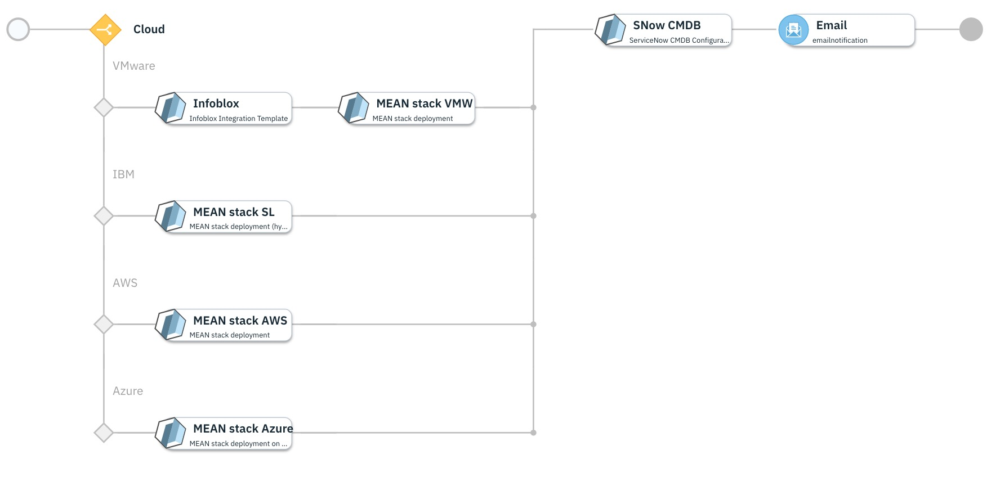
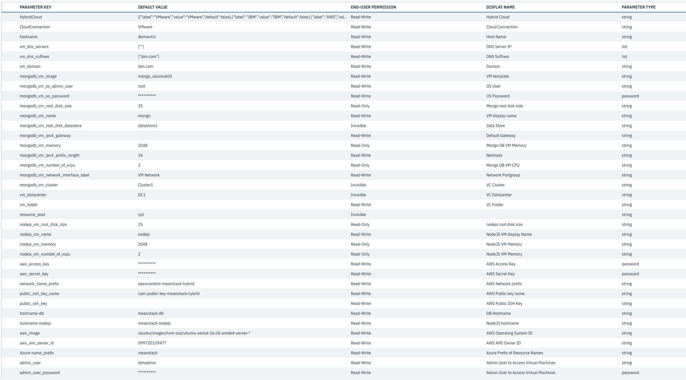

<!---
Copyright IBM Corp. 2018, 2019
This code is released under the Apache 2.0 License.
--->

# Multi Cloud - MEAN Stack deployment

Deploys a hybrid cloud MEAN stack (Mongo, Express, Angular, Node) on your choice of cloud.
This deployment also deploys a simple sample application to validate the stack is operational.
once everything deployed fine it will update the Service Now CMDB and send the email notification.

This service will install and configure MongoDB, Express, AngularJS and Node.js.

## Supported Clouds

- VMWare vSphere
- IBM Cloud
- Amazon EC2
- Microsoft Azure

### Templates versions

| Template Name | Version |
|------|:-------------:|
| [Infoblox Integration Template](https://github.com/IBM-CAMHub-Open/template_integration_infoblox/tree/2.1/other/terraform) | 2.1 |
| [MEAN stack deployment - VMware vSphere](https://github.com/IBM-CAMHub-Open/starterlibrary/tree/2.3/VMware/terraform/hcl/meanstack)| 2.3|
| [MEAN stack deployment - Softlayer](https://github.com/IBM-CAMHub-Open/starterlibrary/tree/2.3/BlueMix/terraform/hcl/meanstack-hybrid)| 2.3|
| [MEAN stack deployment - AWS](https://github.com/IBM-CAMHub-Open/starterlibrary/tree/2.3/AWS/terraform/hcl/meanstack)| 2.3|
| [MEAN stack deployment - Azure](https://github.com/IBM-CAMHub-Open/starterlibrary/tree/2.3/Azure/terraform/hcl/meanstack)| 2.3|
| [ServiceNow CMDB Configuration Template](https://github.com/IBM-CAMHub-Open/template_integration_servicenow/tree/2.0/other/terraform)| 2.0|

## Prerequisites

- Configure the connections to a necessary cloud provider. For configuration steps, refer to Knowledge Center
- Configure an Email server. For configuration steps.
- Configure Infoblox server to get free/available IP address
- Ensure that ServiceNow is up and running.
- 'Data object' for Infoblox 'Data Type' "Infoblox IPAM Server" must be created before using or publishing the service.
    please refer link for more details: [<https://www.ibm.com/support/knowledgecenter/en/SS2L37_3.1.0.0/cam_create_dataobj.html]>
- Ensure all the above tempates with given version is imported in IBM CP4MCM.

## Service Input parameters

