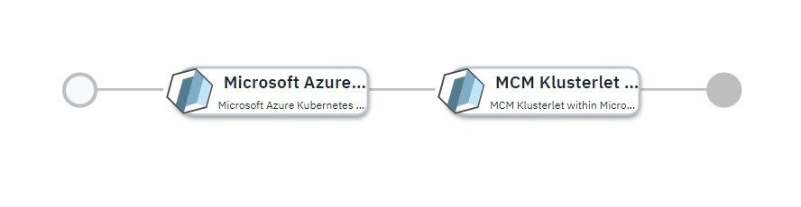

# Microsoft Azure Kubernetes Cluster Imported into IBM Cloud Pak for Multicloud Management

## Overview

This [IBM Cloud Automation Manager](https://www.ibm.com/support/knowledgecenter/SSFC4F/product_welcome_cloud_pak.html) service configuration first uses the [Microsoft Azure provider](https://www.terraform.io/docs/providers/azurerm/index.html) to provision a kubernetes cluster within the [Azure Kubernetes Service](https://azure.microsoft.com/en-us/services/kubernetes-service/).  Once provisioned, the kubernetes cluster will be imported into the [IBM Cloud Pak for Multicloud Management](https://www.ibm.com/support/knowledgecenter/SSFC4F/product_welcome_cloud_pak.html) 2.0.0 hub-cluster to make it a managed cluster.

More details on IBM Cloud Automation Manager Service can be found [here](https://www.ibm.com/support/knowledgecenter/SSFC4F/product_welcome_cloud_pak.html).

This service is composed of following terraform templates

- [Managed Kubernetes Service within Microsoft Azure](https://github.com/IBM-CAMHub-Open/template_kubernetes_aks/tree/1.11) terraform template.
- [MCM Klusterlet within Microsoft Azure Kubernetes Service for Terraform 0.12.x](https://github.com/IBM-CAMHub-Open/template_mcm_install/tree/5.0.0/terraform12/AKS/mcm-klusterlet) terraform template 

This service can be either deployed from service library or from IBM Cloud Pak for Multicloud Management catalog.

* [Deploying the service from IBM Cloud Automation Manager](#deploying-the-service-from-ibm-cloud-automation-manager)
* [Deploying the service from IBM Cloud Pak for Multicloud Management Catalog](#deploying-the-service-from-ibm-cloud-private-catalog)

## Deploying the service from IBM Cloud Automation Manager

To deploy this service from IBM Cloud Automation Manager navigate to Library > Services > AKS cluster. Fill the following input parameters and deploy the service.

| Parameter name                  | Type            | Parameter description | Allowed values |
| :---                            | :---            | :---                  | :---           |
| cloud_connection                | connection      | Name of the Microsoft Azure cloud connection used to deploy the AKS cluster. |
| cluster_name                    | string          | Name of the AKS cluster | Cluster name can have lower case alphabets, numbers and dash. Must start with lower case alphabet and end with alpha-numeric character. Maximum length is 32 characters. |
| azure_region                    | string          | Region within the cloud in which to create the cluster | |
| resource\_group\_name           | string          | Name of the resource group in which the cluster will be created | |
| kube_version                    | string          | Kubernetes version for the cluster. Specify 'latest' for the most recent kubernetes version supported by the Kubernetes Service, or a version number in the X.Y[.Z] format (e.g. 1.13 or 1.13.5).  The most recent maintenance release for the specified version will be selected. | |
| principal_id                    | string          | Service principal ID | |
| principal_password              | string          | Service principal password | |
| ssh\_public\_key                | string          | Public key used to grant access to the worker agent VM, Base64 encoded | |
| MCM Controller Data Object      | sharedparameter | Details of the MCM controller this newly created cluster will be registered with. Pointing to a data object created from the [mcm_controller](https://github.com/IBM-CAMHub-Open/template_cam_common/blob/3.2.1/common/datatypes/mcm_controller.json) data type| |
| username                        | string          | Login name used to access the worker agent VM | |
| worker\_vm\_size                | string          | Size of the worker node VM | |
| worker_count                    | string          | Number of worker agents | |
| enable_monitoring               | string          | Indicates whether monitoring should be enabled on the cluster | true, false |
| monitoring\_solution\_name      | string          | Name of the monitoring solution | |
| monitoring\_solution\_publisher | string          | Publisher of the monitoring solution | |
| monitoring\_solution\_product   | string          | Product name of the monitoring solution | |
| monitoring\_sku                 | string          | Pricing SKU for the monitoring workspace | |
| monitoring\_retention\_days     | string          | Number of days to retain monitoring data | 30 - 730 |

## Deploying the service from IBM Cloud Pak for Multicloud Management Catalog

To deploy this service from IBM Cloud Pak for Multicloud Management Catalog navigate to Catalog, search the Catalog for aks-cluster and fill the following input parameters and install the service.

Note: Some parameters may have fixed default values.  If you need to change them, make a copy of this service configuration and create a new service in IBM Cloud Automation Manager with the new configuration. 

| Parameter name                  | Type            | Parameter description | Allowed values |
| :---                            | :---            | :---                  | :---           |
| cloud_connection                | connection      | Name of the Microsoft Azure cloud connection used to deploy the AKS cluster. |
| cluster_name                    | string          | Name of the AKS cluster | |
| azure_region                    | string          | Region within the cloud in which to create the cluster | |
| resource\_group\_name           | string          | Name of the resource group in which the cluster will be created | |
| kube_version                    | string          | Kubernetes version for the cluster. Specify 'latest' for the most recent kubernetes version supported by the Kubernetes Service, or a version number in the X.Y[.Z] format (e.g. 1.13 or 1.13.5).  The most recent maintenance release for the specified version will be selected. | |
| principal_id                    | string          | Service principal ID | |
| principal_password              | string          | Service principal password | |
| ssh\_public\_key                | string          | Public key used to grant access to the worker agent VM, Base64 encoded | |
| MCM Controller Data Object      | sharedparameter | Details of the MCM controller this newly created cluster will be registered with. Pointing to a data object created from the [mcm_controller](https://github.com/IBM-CAMHub-Open/template_cam_common/blob/3.2.1/common/datatypes/mcm_controller.json) data type| |
| username                        | string          | Login name used to access the worker agent VM | |
| worker\_vm\_size                | string          | Size of the worker node VM | |
| worker_count                    | string          | Number of worker agents | |
| enable_monitoring               | string          | Indicates whether monitoring should be enabled on the cluster | true, false |
| monitoring\_solution\_name      | string          | Name of the monitoring solution | |
| monitoring\_solution\_publisher | string          | Publisher of the monitoring solution | |
| monitoring\_solution\_product   | string          | Product name of the monitoring solution | |
| monitoring\_sku                 | string          | Pricing SKU for the monitoring workspace | |
| monitoring\_retention\_days     | string          | Number of days to retain monitoring data | 30 - 730 |

### License and Maintainer

Copyright IBM Corp. 2020

Service Version - 5.0.0 
 