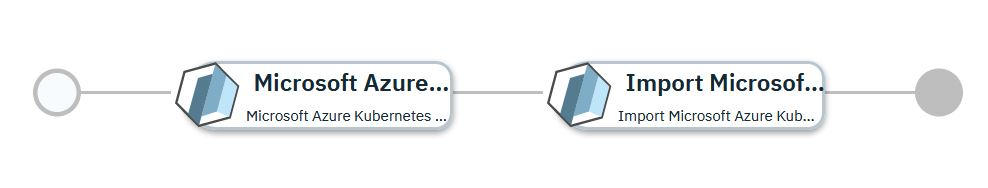

# Microsoft Azure Kubernetes Cluster Imported into Red Hat Advanced Cluster Management enabled IBM Cloud Pak for Multicloud Management

## Overview

This [IBM Cloud Pak for Multicloud Management](https://www.ibm.com/support/knowledgecenter/SSFC4F/product_welcome_cloud_pak.html) service configuration first uses the [Microsoft Azure provider](https://www.terraform.io/docs/providers/azurerm/index.html) to provision a kubernetes cluster within the [Azure Kubernetes Service](https://azure.microsoft.com/en-us/services/kubernetes-service/).  Once provisioned, the kubernetes cluster will be imported into the [Red Hat Advanced Cluster Management enabled IBM Cloud Pak for Multicloud Management](https://www.ibm.com/support/knowledgecenter/SSFC4F/product_welcome_cloud_pak.html) 2.x hub-cluster to make it a managed cluster.

This service is composed of following terraform templates

- [Microsoft Azure Kubernetes Service for Terraform 0.12.x](https://github.com/IBM-CAMHub-Open/template_kubernetes_aks/tree/1.11) terraform template.
- [Import Microsoft Azure Kubernetes Service into RHACM enabled IBM CP4MCM](https://github.com/IBM-CAMHub-Open/template_import_rhacm/tree/5.1.0/terraform12/AKS/mcm-klusterlet) terraform template 

You can first test deploy the service and once satisfied, you can publish the service to the service library and then deploy the production ready service from the service library. 
By default this service is in global namespace. So before you publish you need to duplicate this service (see IBM Cloud Pak for Multicloud Management documentation on how to duplicate a service) in the user assigned namespace and then publish it to service library.

* [Test Deploy the Service](#test-deploy-the-service)
* [Deploying the service from Service Library](#deploying-the-service-from-service-library)

## Test Deploy the Service

To test deploy this service navigate to Automate Infrastructure > Manage Services > Azure Kubernetes Service Cluster with RHACM import > Select a version > Test deploy. Fill the following input parameters and deploy the service.

| Parameter name                  | Type            | Parameter description | Allowed values |
| :---                            | :---            | :---                  | :---           |
| cloud_connection                | connection      | Name of the Microsoft Azure cloud connection used to deploy the AKS cluster. |
| cluster_name                    | string          | Name of the AKS cluster | Cluster name can have lower case alphabets, numbers and dash. Must start with lower case alphabet and end with alpha-numeric character. Maximum length is 32 characters. |
| azure_region                    | string          | Region within the cloud in which to create the cluster | |
| resource\_group\_name           | string          | Name of the resource group in which the cluster will be created | |
| kube_version                    | string          | Kubernetes version for the cluster. Specify 'latest' for the most recent kubernetes version supported by the Kubernetes Service, or a version number in the X.Y[.Z] format (e.g. 1.13 or 1.13.5).  The most recent maintenance release for the specified version will be selected. | |
| principal_id                    | string          | Service principal ID | |
| principal_password              | string          | Service principal password | |
| ssh\_public\_key                | string          | Public key used to grant access to the worker agent VM, Base64 encoded | |
| OpenShift Container Platform Login Information     | sharedparameter | Details of the OCP on which RHACM enabled IBM CP4MMCM is installed. This newly created cluster will be registered to this RHACM and IBM CP4MCM. Pointing to a data object created from the [oc_login_info](https://github.com/IBM-CAMHub-Open/template_import_rhacm/blob/5.1.0/terraform12/datatypes/ocp.json) data type| |
| username                        | string          | Login name used to access the worker agent VM | |
| worker\_vm\_size                | string          | Size of the worker node VM | |
| worker_count                    | string          | Number of worker agents | |
| enable_monitoring               | string          | Indicates whether monitoring should be enabled on the cluster | true, false |
| monitoring\_solution\_name      | string          | Name of the monitoring solution | |
| monitoring\_solution\_publisher | string          | Publisher of the monitoring solution | |
| monitoring\_solution\_product   | string          | Product name of the monitoring solution | |
| monitoring\_sku                 | string          | Pricing SKU for the monitoring workspace | |
| monitoring\_retention\_days     | string          | Number of days to retain monitoring data | 30 - 730 |
| kube_ctl_version                | string          | The kubectl version to use in import client. For compatibility reasons, this version must match the version in the kubernetes service. The latest client version may not be compatible with the latest kubernetes version used in the server. It is recommended that you set an explicit version. Version format must be vM.m.p eg. v1.23.6. | |

## Deploying the service from Service Library

To deploy this service from Service Library navigate to Automate Infrastructure > Service Library, select the published service and fill the following input parameters and install the service.

Note: Some parameters may have fixed default values. If you need to change them, duplicate the service configuration and create a new service with the new configuration. 

| Parameter name                  | Type            | Parameter description | Allowed values |
| :---                            | :---            | :---                  | :---           |
| cloud_connection                | connection      | Name of the Microsoft Azure cloud connection used to deploy the AKS cluster. |
| cluster_name                    | string          | Name of the AKS cluster | |
| azure_region                    | string          | Region within the cloud in which to create the cluster | |
| resource\_group\_name           | string          | Name of the resource group in which the cluster will be created | |
| kube_version                    | string          | Kubernetes version for the cluster. Specify 'latest' for the most recent kubernetes version supported by the Kubernetes Service, or a version number in the X.Y[.Z] format (e.g. 1.13 or 1.13.5).  The most recent maintenance release for the specified version will be selected. | |
| principal_id                    | string          | Service principal ID | |
| principal_password              | string          | Service principal password | |
| ssh\_public\_key                | string          | Public key used to grant access to the worker agent VM, Base64 encoded | |
| OpenShift Container Platform Login Information     | sharedparameter | Details of the OCP on which RHACM enabled IBM CP4MMCM is installed. This newly created cluster will be registered to this RHACM and IBM CP4MCM. Pointing to a data object created from the [oc_login_info](https://github.com/IBM-CAMHub-Open/template_import_rhacm/blob/5.1.0/terraform12/datatypes/ocp.json) data type| |
| username                        | string          | Login name used to access the worker agent VM | |
| worker\_vm\_size                | string          | Size of the worker node VM | |
| worker_count                    | string          | Number of worker agents | |
| enable_monitoring               | string          | Indicates whether monitoring should be enabled on the cluster | true, false |
| monitoring\_solution\_name      | string          | Name of the monitoring solution | |
| monitoring\_solution\_publisher | string          | Publisher of the monitoring solution | |
| monitoring\_solution\_product   | string          | Product name of the monitoring solution | |
| monitoring\_sku                 | string          | Pricing SKU for the monitoring workspace | |
| monitoring\_retention\_days     | string          | Number of days to retain monitoring data | 30 - 730 |
| kube_ctl_version                | string          | The kubectl version to use in import client. For compatibility reasons, this version must match the version in the kubernetes service. The latest client version may not be compatible with the latest kubernetes version used in the server. It is recommended that you set an explicit version. Version format must be vM.m.p eg. v1.23.6. | |

### License and Maintainer

Copyright IBM Corp. 2022

Service Version - 2.0.0.0
 