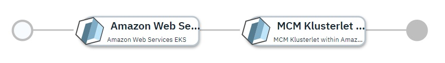

# Amazon Elastic Cloud Kubernetes Cluster Imported into IBM Multicloud Manager

## Overview

This [IBM Cloud Automation Manager](https://www.ibm.com/support/knowledgecenter/en/SS2L37/product_welcome_cloud_automation_manager.html) service configuration first uses the [Amazon Web Services provider](https://www.terraform.io/docs/providers/aws/index.html) to provision a kubernetes cluster within the [Amazon Elastic Kubernetes Service](https://aws.amazon.com/eks/).  Once provisioned, the kubernetes cluster will be imported into the [IBM Multicloud Manager](https://www.ibm.com/support/knowledgecenter/en/SSBS6K_3.2.0/mcm/getting_started/introduction.html) 3.2.0 hub-cluster to make it a managed cluster.

More details on IBM Cloud Automation Manager Service can be found [here](https://www.ibm.com/support/knowledgecenter/en/SS2L37_3.2.1.0/cam_managing_services.html).

This service is composed of following terraform templates

- [Managed Kubernetes Service within Amazon EC2 Cloud](https://github.com/IBM-CAMHub-Open/template_kubernetes_eks/tree/1.11) terraform template.
- [MCM Klusterlet 3.2.0 within Amazon Elastic Kubernetes Service](https://github.com/IBM-CAMHub-Open/template_mcm_install/tree/3.2.0/EKS/mcm-klusterlet) terraform template 

This service can be either deployed from IBM Cloud Automation Manager or from IBM Cloud Private Catalog.

* [Deploying the service from IBM Cloud Automation Manager](#deploying-the-service-from-ibm-cloud-automation-manager)
* [Deploying the service from IBM Cloud Private Catalog](#deploying-the-service-from-ibm-cloud-private-catalog)

## Deploying the service from IBM Cloud Automation Manager

To deploy this service from IBM Cloud Automation Manager navigate to Library > Services > MCM on EKS > Deploy and import EKS cluster. Fill the following input parameters and deploy the service.

Note: The parameters indicated as _(hidden)_ have default values.  If you need to change them, make a copy of this service configuration and create a new service in IBM Cloud Automation Manager with the new configuration. 

| Parameter name                  | Type            | Parameter description |
| :---                            | :---            | :---                  |
| cloud_connection                | connection      | Name of the Amazon EC2 cloud connection used to deploy the EKS cluster. |
| cluster_name                    | string          | Name of the deployed cluster within the kubernetes service |
| aws_region                      | string          | AWS region within the cloud in which to create the cluster |
| kube_version                    | string          | Kubernetes version for the cluster. Specify 'latest' for the most recent kubernetes version supported by the Kubernetes Service, or a version number in the X.Y[.Z] format (e.g. 1.13 or 1.13.5).  The most recent maintenance release for the specified version will be selected. |
| access\_key\_id                 | string          | Key ID for gaining access to the cloud and Kubernetes Service |
| access\_key\_secret             | string          | Key secret for gaining access to the cloud and Kubernetes Service |
| MCM Controller Data Object      | sharedparameter | Details of the MCM controller this newly created cluster will be registered with. Pointing to a data object created from the [mcm_controller](https://github.com/IBM-CAMHub-Open/template_cam_common/blob/3.2.1/common/datatypes/mcm_controller.json) data type|
| aws\_ami\_owner\_id             | string          | _(hidden)_ Owner ID of the AMI ID configured for use as a worker node |
| aws\_ami\_name\_prefix          | string          | _(hidden)_ Prefix of the AMI name, used to find the most recent version of the appropriate AMI for the specified kubernetes version |
| aws\_image\_size                | string          | _(hidden)_ Size of the worker node image(s) |
| min\_worker\_count              | string          | _(hidden)_ Miniumum number of worker nodes permitted within the cluster |
| max\_worker\_count              | string          | _(hidden)_ Maximum number of worker nodes permitted within the cluster |
| initial\_worker\_count          | string          | _(hidden)_ Initial number of worker nodes to be created within the cluster |

## Deploying the service from IBM Cloud Private Catalog

To deploy this service from IBM Cloud Private Catalog navigate to Catalog, search the Catalog for deploy-and-import-eks-cluster and fill the following input parameters and install the service.

Note: The parameters indicated as _(hidden)_ have default values.  If you need to change them, make a copy of this service configuration and create a new service in IBM Cloud Automation Manager with the new configuration. 

| Parameter name                  | Type            | Parameter description |
| :---                            | :---            | :---                  |
| cloud_connection                | connection      | Name of the Amazon EC2 cloud connection used to deploy the EKS cluster. |
| cluster_name                    | string          | Name of the deployed cluster within the kubernetes service |
| aws_region                      | string          | AWS region within the cloud in which to create the cluster |
| kube_version                    | string          | Kubernetes version for the cluster. Specify 'latest' for the most recent kubernetes version supported by the Kubernetes Service, or a version number in the X.Y[.Z] format (e.g. 1.13 or 1.13.5).  The most recent maintenance release for the specified version will be selected. |
| access\_key\_id                 | string          | Key ID for gaining access to the cloud and Kubernetes Service |
| access\_key\_secret             | string          | Key secret for gaining access to the cloud and Kubernetes Service |
| MCM Controller Data Object      | sharedparameter | Details of the MCM controller this newly created cluster will be registered with. Pointing to a data object created from the [mcm_controller](https://github.com/IBM-CAMHub-Open/template_cam_common/blob/3.2.1/common/datatypes/mcm_controller.json) data type|
| aws\_ami\_owner\_id             | string          | _(hidden)_ Owner ID of the AMI ID configured for use as a worker node |
| aws\_ami\_name\_prefix          | string          | _(hidden)_ Prefix of the AMI name, used to find the most recent version of the appropriate AMI for the specified kubernetes version |
| aws\_image\_size                | string          | _(hidden)_ Size of the worker node image(s) |
| min\_worker\_count              | string          | _(hidden)_ Miniumum number of worker nodes permitted within the cluster |
| max\_worker\_count              | string          | _(hidden)_ Maximum number of worker nodes permitted within the cluster |
| initial\_worker\_count          | string          | _(hidden)_ Initial number of worker nodes to be created within the cluster |

### License and Maintainer

Copyright IBM Corp. 2019

Service Version - 3.2.0  
 