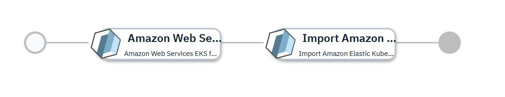

# Amazon Elastic Cloud Kubernetes Cluster Imported into Red Hat Advanced Cluster Management enabled IBM Cloud Pak for Multicloud Management

## Overview

This [IBM Cloud Pak for Multicloud Management](https://www.ibm.com/support/knowledgecenter/SSFC4F/product_welcome_cloud_pak.html) service configuration first uses the [Amazon Web Services provider](https://www.terraform.io/docs/providers/aws/index.html) to provision a kubernetes cluster within the [Amazon Elastic Kubernetes Service](https://aws.amazon.com/eks/).  Once provisioned, the kubernetes cluster will be imported into the [Red Hat Advanced Cluster Management enabled IBM Cloud Pak for Multicloud Management](https://www.ibm.com/support/knowledgecenter/SSFC4F/product_welcome_cloud_pak.html) 2.x hub-cluster to make it a managed cluster.

This service is composed of following terraform templates

- [Amazon Web Services EKS for Terraform 0.12.x](https://github.com/IBM-CAMHub-Open/template_kubernetes_eks/tree/1.11) terraform template.
- [Import Amazon Elastic Kubernetes Service into RHACM enabled IBM CP4MCM](https://github.com/IBM-CAMHub-Open/template_import_rhacm/tree/5.1.0/terraform12/EKS/mcm-klusterlet) terraform template 

You can first test deploy the service and once satisfied, you can publish the service to the service library and then deploy the production ready service from the service library. 
By default this service is in global namespace. So before you publish you need to duplicate this service (see IBM Cloud Pak for Multicloud Management documentation on how to duplicate a service) in the user assigned namespace and then publish it to service library.

* [Test Deploy the Service](#test-deploy-the-service)
* [Deploying the service from Service Library](#deploying-the-service-from-service-library)

## Test Deploy the Service

To test deploy this service navigate to Automate Infrastructure > Manage Services >  Amazon Elastic Kubernetes Service Cluster with RHACM import > Select a version > Test deploy. Fill the following input parameters and deploy the service.

| Parameter name                  | Type            | Parameter description |
| :---                            | :---            | :---                  |
| cloud_connection                | connection      | Name of the Amazon EC2 cloud connection used to deploy the EKS cluster. |
| cluster_name                    | string          | Name of the deployed cluster within the kubernetes service. Cluster name can have lower case alphabets, numbers and dash. Must start with lower case alphabet and end with alpha-numeric character. Maximum length is 32 characters. |
| aws_region                      | string          | AWS region within the cloud in which to create the cluster |
| kube_version                    | string          | Kubernetes version for the cluster. Specify 'latest' for the most recent kubernetes version supported by the Kubernetes Service, or a version number in the X.Y[.Z] format (e.g. 1.13 or 1.13.5).  The most recent maintenance release for the specified version will be selected. |
| access\_key\_id                 | string          | Key ID for gaining access to the cloud and Kubernetes Service |
| access\_key\_secret             | string          | Key secret for gaining access to the cloud and Kubernetes Service |
| OpenShift Container Platform Login Information     | sharedparameter | Details of the OCP on which RHACM enabled IBM CP4MMCM is installed. This newly created cluster will be registered to this RHACM and IBM CP4MCM. Pointing to a data object created from the [oc_login_info](https://github.com/IBM-CAMHub-Open/template_import_rhacm/blob/5.1.0/terraform12/datatypes/ocp.json) data type| |
| aws\_ami\_owner\_id             | string          | Owner ID of the AMI ID configured for use as a worker node |
| aws\_ami\_name\_prefix          | string          | Prefix of the AMI name, used to find the most recent version of the appropriate AMI for the specified kubernetes version |
| aws\_image\_size                | string          | Size of the worker node image(s) |
| min\_worker\_count              | string          | Miniumum number of worker nodes permitted within the cluster |
| max\_worker\_count              | string          | Maximum number of worker nodes permitted within the cluster |
| initial\_worker\_count          | string          | Initial number of worker nodes to be created within the cluster |

## Deploying the service from Service Library

To deploy this service from Service Library navigate to Automate Infrastructure > Service Library, select the published service and fill the following input parameters and install the service.

Note: Some parameters may have fixed default values. If you need to change them, duplicate the service configuration and create a new service with the new configuration. 

| Parameter name                  | Type            | Parameter description |
| :---                            | :---            | :---                  |
| cloud_connection                | connection      | Name of the Amazon EC2 cloud connection used to deploy the EKS cluster. |
| cluster_name                    | string          | Name of the deployed cluster within the kubernetes service |
| aws_region                      | string          | AWS region within the cloud in which to create the cluster |
| kube_version                    | string          | Kubernetes version for the cluster. Specify 'latest' for the most recent kubernetes version supported by the Kubernetes Service, or a version number in the X.Y[.Z] format (e.g. 1.13 or 1.13.5).  The most recent maintenance release for the specified version will be selected. |
| access\_key\_id                 | string          | Key ID for gaining access to the cloud and Kubernetes Service |
| access\_key\_secret             | string          | Key secret for gaining access to the cloud and Kubernetes Service |
| OpenShift Container Platform Login Information     | sharedparameter | Details of the OCP on which RHACM enabled IBM CP4MMCM is installed. This newly created cluster will be registered to this RHACM and IBM CP4MCM. Pointing to a data object created from the [oc_login_info](https://github.com/IBM-CAMHub-Open/template_import_rhacm/blob/5.1.0/terraform12/datatypes/ocp.json) data type| |
| aws\_ami\_owner\_id             | string          | Owner ID of the AMI ID configured for use as a worker node |
| aws\_ami\_name\_prefix          | string          | Prefix of the AMI name, used to find the most recent version of the appropriate AMI for the specified kubernetes version |
| aws\_image\_size                | string          | Size of the worker node image(s) |
| min\_worker\_count              | string          | Miniumum number of worker nodes permitted within the cluster |
| max\_worker\_count              | string          | Maximum number of worker nodes permitted within the cluster |
| initial\_worker\_count          | string          | Initial number of worker nodes to be created within the cluster |

### License and Maintainer

Copyright IBM Corp. 2020

Service Version - 1.0.0.0