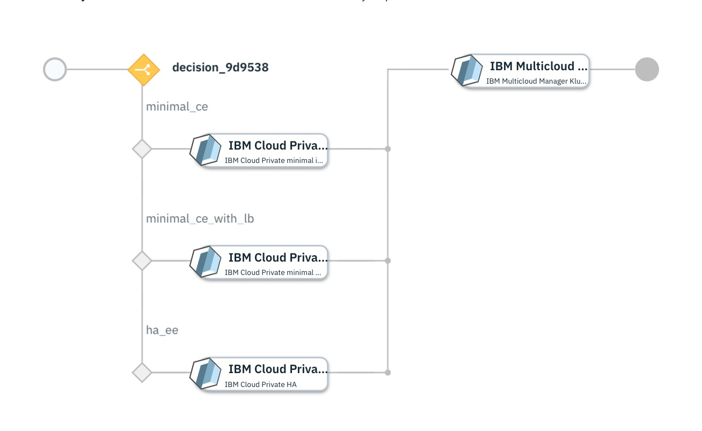

# OpenShift Container Platform 3.11 cluster on VMware 

## Overview
This service deploys IBM Cloud Private (ICP) cluster version 3.2.0 on IBM Cloud and imports it into an existing IBM Multi Cloud Manager (MCM) controller.

## Supported topologies

The service contains a decision points which allows customers to chose one of the following three ICP topologies: 
1. [IBM Cloud Private minimal installation](https://github.com/IBM-CAMHub-Open/template_icp_ibmcloud/tree/3.2.0/templates/icp-ce-minimal) In this topology, a 4 node topology ( one master, one proxy, one management and one worker) is deployed in IBM Cloud. Refer to the template documentation for more details.

2. [IBM Cloud Private minimal with load balancers](https://github.com/IBM-CAMHub-Open/template_icp_ibmcloud/tree/3.2.0/templates/icp-ce-with-loadbalancers) In this topology, a 6 node topology (one master, one proxy, one management and three wokers) is deployed in IBM Cloud. In addition, a load balancer is also deployed in the IBM Cloud for the master node and one for the proxy node. Refer to the template documentation for more details.

3. [IBM Cloud Private HA](https://github.com/IBM-CAMHub-Open/template_icp_ibmcloud/tree/3.2.0/templates/icp-ee)
In this topology, a 11 node topology (one boot node, three master, three proxy, one management and three wokers) is deployed in IBM Cloud. In addition, a load balancer is also deployed in the IBM Cloud for the master node and one for the proxy node. Refer to the template documentation for more details.

The second activity of the service is [IBM Multicloud Manager Klusterlet on IBM Cloud Private](https://github.com/IBM-CAMHub-Open/template_mcm_install/tree/3.2.0/ICP/terraform) It performs an MCM import which will register the newly deployed MCM cluster with an existing MCM controller(hub) 

## Service input
The following service plans are defined:
 - ### ICP CE Minimal

| Parameter Name | Type | Description |
| ----- | ----------| ----- |
| Public Key Name | list | Array of SSH keys to add to root for all created VSI instances|
| Datacenter|string|IBM Cloud datacenter to create the cluster in|
| Cluster Name|string|Cluster name. The name must be 1-52 alphanumeric characters and dash|
| Private Key (base64 encoded)|string|Private key corresponding to the existing IBM Cloud public key. Used by automation to load the MCM docker images and helm charts on the ICP cluster|
| Cloud Connection|cloudconnection|IBM Cloud Connection used to deploy the ICP cluster into the IBM Cloud|
| MCM Controller Data Object|sharedparameter|Details of the MCM controller this newly created cluster will be registered with. Pointing to a data object created from the [mcm_controller](https://github.com/IBM-CAMHub-Open/template_cam_common/blob/3.2.1/common/datatypes/mcm_controller.json) data type|

 - ### ICP CE Minimal with Load Balancers
 | Parameter Name | Type | Description |
| ----- | ----------| ----- |
| Public Key Name | list | Array of SSH keys to add to root for all created VSI instances|
| Datacenter|string|IBM Cloud datacenter to create the cluster in|
| Cluster Name|string|Cluster name. The name must be 1-52 alphanumeric characters and dash|
| Private Key (base64 encoded)|string|Private key corresponding to the existing IBM Cloud public key. Used by automation to load the MCM docker images and helm charts on the ICP cluster|
| Cloud Connection|cloudconnection|IBM Cloud Connection used to deploy the ICP cluster into the IBM Cloud|
| MCM Controller Data Object|sharedparameter|Details of the MCM controller this newly created cluster will be registered with. Pointing to a data object created from the [mcm_controller](https://github.com/IBM-CAMHub-Open/template_cam_common/blob/3.2.1/common/datatypes/mcm_controller.json) data type|

 - ### ICP EE with High Availability
| Parameter Name | Type | Description |
| ----- | ----------| ----- |
| Public Key Name | list | Array of SSH keys to add to root for all created VSI instances|
| Datacenter|string|IBM Cloud datacenter to create the cluster in|
| Cluster Name|string|Cluster name. The name must be 1-52 alphanumeric characters and dash|
| Private Key (base64 encoded)|string|Private key corresponding to the existing IBM Cloud public key. Used by automation to load the MCM docker images and helm charts on the ICP cluster|
| ICP EE Image Location|string|URI for the ICP image package location|
| Boot Node Configuration|map|Structure containing the boot node specification (cpu, memory, disk, etc)|
| Master Node Configuration|map|Structure containing the master node specification (cpu, memory, disk, etc)|
| Proxy Node Configuration|map|Structure containing the proxy node specification (cpu, memory, disk, etc)|
| Management Node Configuration|map|Structure containing the management node specification (cpu, memory, disk, etc)|
| Worker Node Configuration|map|Structure containing the worker node specification (cpu, memory, disk, etc)|
| VA Node Configuration|map|Structure containing the vulneravility advisor (VA) node specification (cpu, memory, disk, etc)|
| Cloud Connection|cloudconnection|IBM Cloud Connection used to deploy the ICP cluster into the IBM Cloud|
| MCM Controller Data Object|sharedparameter|Details of the MCM controller this newly created cluster will be registered with. Pointing to a data object created from the [mcm_controller](https://github.com/IBM-CAMHub-Open/template_cam_common/blob/3.2.1/common/datatypes/mcm_controller.json) data type|

### License and Maintainer

Copyright IBM Corp. 2019

Service Version - 3.2.0  