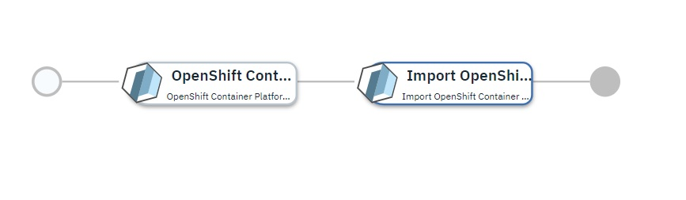

# OpenShift Container Platform 4.2 cluster on VMware 

## Overview
This service deploys OpenShift Container Platform (OCP) cluster version 4.2 on VMware and imports it into an existing 2.0.0 IBM CLoud Pak for Multi Cloud Manager (MCM).

## Supported topologies

The first activity of the service is to deploy a new [OpenShift Container Platform Enterprise Installation](https://github.com/IBM-CAMHub-Open/template_openshift_installer/tree/4.2/terraform12/vmware/terraform). Refer to the template documentation for more details. 

The second activity of the service is [Import OpenShift Container Platform Kubernetes cluster into MCM hub-cluster for Terraform 0.12.x](https://github.com/IBM-CAMHub-Open/template_mcm_install/tree/5.0.0/terraform12/OCP/terraform) It performs a MCM import which will register the newly deployed MCM cluster with an existing MCM controller(hub) 

NOTE: To support the import of the OCP cluster into the MCM hub-cluster, it is expected that the default CPU and memory values defined for the [openshift42_compute_node_on_vmware](https://github.com/IBM-CAMHub-Open/template_cam_common/blob/4.1.0/common/datatypes/openshift42_compute_node_on_vmware.json) data object should be increased.  Import was verified with double the defined CPU and memory values.

## Service input

### OpenShift Container Platform Enterprise Installation

| Parameter Name | Type | Description |
| ----- | ----------| ----- |
| VMWare Cloud Connection | connection | Name of the VMware cloud connection used to deploy the OpenShift Container Platform |
| vSphere Managed Inventory Definition Data Object | sharedparameter | vSphere Managed Inventory Definition. Pointing to a data object created from the [vsphere_managed_inventory_definition](https://github.com/IBM-CAMHub-Open/template_cam_common/blob/3.2.1/common/datatypes/vsphere_inventory.json) data type |
| OpenShift 4.2 Bootstrap Node Configuration Data Object | sharedparameter | Pointing to a data object created from the [openshift42_bootstrap_node_on_vmware](https://github.com/IBM-CAMHub-Open/template_cam_common/blob/4.1.0/common/datatypes/openshift42_bootstrap_node_on_vmware.json) data type |
| OpenShift 4.2 Infrastructure Node Configuration Data Object | sharedparameter | Pointing to a data object created from the [openshift42_infra_node_on_vmware](https://github.com/IBM-CAMHub-Open/template_cam_common/blob/4.1.0/common/datatypes/openshift42_infra_node_on_vmware.json) data type |
| OpenShift 4.2 Control Plane Node Configuration Data Object | sharedparameter | Pointing to a data object created from the [openshift42_control_plane_node_on_vmware](https://github.com/IBM-CAMHub-Open/template_cam_common/blob/4.1.0/common/datatypes/openshift42_control_plane_node_on_vmware.json) data type |
| OpenShift 4.2 Compute Node Configuration Data Object | sharedparameter | Pointing to a data object created from the [openshift42_compute_node_on_vmware](https://github.com/IBM-CAMHub-Open/template_cam_common/blob/4.1.0/common/datatypes/openshift42_compute_node_on_vmware.json) data type |
| clustername | string | A unique name that identifies each OCP cluster. The combination of this cluster name and the OCP domain name creates a cluster domain, that will be used by OCP cluster nodes and the URLs. |
| infranode_hostname | string | Infrastructure Node Hostname |
| infranode_ip | string | Infrastructure Node Public IP Address. This IP address must have a mapping to the OCP cluster app URL in your DNS or in your local etc hosts file. |
| ocp\_cluster\_domain | string | OCP Base Domain Name. The combination of cluster name and this domain name creates what a cluster domain, that will be used by OCP cluster nodes and the URLs. |
| ocp\_vm\_template | string | Name of the VM template to clone to create VMs for the cluster. |
| pullsecret | string | Base64 encoded OCP image pull secret. You can obtain this from your Red Hat account page. |
| vm\_private\_network_interface_label | string | Private vSphere Network name for infrastructure and OCP cluster VM. |
| vsphere_cluster | string | Name of the vSphere cluster. |

### Import OpenShift Container Platform Kubernetes Cluster into MCM hub-cluster

| Parameter Name | Type | Description |
| ----- | ----------| ----- |
| MCM Controller Data Object | sharedparameter | Details of the MCM controller this newly created cluster will be registered with. Pointing to a data object created from the [mcm_controller](https://github.com/IBM-CAMHub-Open/template_cam_common/blob/3.2.1/common/datatypes/mcm_controller.json) data type |
| ocp\_oauth\_url | string | URL for OCP OAUTH Server, for retrieving access token to OCP cluster |
| image_registry | string | URL for private docker registry from which klusterlet images will be pulled |
| image_suffix | string | Suffix (e.g. platform type) to be appended to image name |
| image_version | string | Version (tag) of the MCM image to be pulled |
| docker_user | string | Username for authenticating with the private docker registry |
| docker_password | string | Password for authenticating with the private docker registry |

### License and Maintainer

Copyright IBM Corp. 2020

Service Version - 5.0.0  