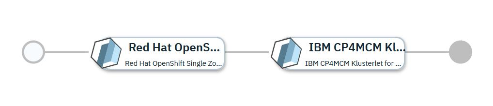

# RedHat OpenShift Service on IBM Cloud cluster imported into IBM Cloud Pak for Multicloud Management

## Overview

This [IBM Cloud Automation Manager](https://www.ibm.com/support/knowledgecenter/SSFC4F/product_welcome_cloud_pak.html) service configuration first uses the [IBM Cloud provider](https://cloud.ibm.com/docs/terraform?topic=terraform-tf-provider) to provision a ROKS cluster within the [IBM Cloud](https://www.ibm.com/cloud/openshift). Once provisioned, the kubernetes cluster will be imported into the [IBM Cloud Pak for Multicloud Management](https://www.ibm.com/support/knowledgecenter/SSFC4F/product_welcome_cloud_pak.html) 2.0.0 hub-cluster to make it a managed cluster.

More details on IBM Cloud Automation Manager Service can be found [here](https://www.ibm.com/support/knowledgecenter/SSFC4F/product_welcome_cloud_pak.html).

This service is composed of following terraform templates

- [Red Hat OpenShift Single Zone Cluster on IBM Cloud](https://github.com/IBM-CAMHub-Open/template_ibm_roks/tree/1.0) terraform template.
- [IBM CP4MCM Klusterlet for RedHat OpenShift Kubernetes Service on IBM Cloud](https://github.com/IBM-CAMHub-Open/template_mcm_install/tree/5.0.0/terraform12/ROKS/mcm-klusterlet) terraform template 

This service can be either deployed from IBM Cloud Automation Manager or from IBM Cloud Pak for Multicloud Management Catalog.

* [Deploying the service from IBM Cloud Automation Manager](#deploying-the-service-from-ibm-cloud-automation-manager)
* [Deploying the service from IBM Cloud Pak for Multicloud Management Catalog](#deploying-the-service-from-ibm-cloud-private-catalog)

## Deploying the service from IBM Cloud Automation Manager

To deploy this service from IBM Cloud Automation Manager navigate to Library > Services > ROKS cluster. Fill the following input parameters and deploy the service.

| Parameter name                  | Type            | Parameter description |
| :---                            | :---            | :---        |
| cloud_connection                | cloudconnection | Name of the IBM cloud connection used to deploy the ROKS cluster. |
| cluster_name                    | string          | Name of the ROKS cluster. Cluster name can have lower case alphabets, numbers and dash. Must start with lower case alphabet and end with alpha-numeric character. Maximum length is 32 characters. |
| roks_version                    | string          | OCP version for the cluster. You can specify version 3.11_openshift or 4.3.1_openshift
| MCM Controller Data Object      | sharedparameter | Details of the MCM controller this newly created cluster will be registered with. Pointing to a data object created from the [mcm_controller](https://github.com/IBM-CAMHub-Open/template_cam_common/blob/5.0.0/common/datatypes/mcm_controller.json) data type|
| region                          | string          | Region in which to create the cluster |
| resource\_group\_name           | string          | Name of the resource group in which the cluster will be created |
| private\_vlan\_id               | string          | ID for the cluster's private VLAN |
| public\_vlan\_id                | string          | ID for the cluster's public VLAN |
| subnet_id                       | string          | ID for cluster's subnet |
| num_workers                     | string          | Number of worker nodes in the cluster |
| datacenter                      | string          | Datacenter in which to create the cluster |
| machine_type                    | string          | Identifier for the VM type/configuration (CPU count, memory, network and speed) |

## Deploying the service from IBM Cloud Pak for Multicloud Management Catalog

To deploy this service from IBM Cloud Pak for Multicloud Management Catalog navigate to Catalog, search the Catalog for ROKS Cluster and fill the following input parameters and install the service.

| Parameter name                  | Type            | Parameter description |
| :---                            | :---            | :---        |
| cloud_connection                | cloudconnection | Name of the IBM cloud connection used to deploy the ROKS cluster. |
| cluster_name                    | string          | Name of the ROKS cluster |
| roks_version                    | string          | OCP version for the cluster. You can specify version 3.11_openshift or 4.3.1_openshift
| MCM Controller Data Object      | sharedparameter | Details of the MCM controller this newly created cluster will be registered with. Pointing to a data object created from the [mcm_controller](https://github.com/IBM-CAMHub-Open/template_cam_common/blob/5.0.0/common/datatypes/mcm_controller.json) data type|
| region                          | string          | Region in which to create the cluster |
| resource\_group\_name           | string          | Name of the resource group in which the cluster will be created |
| private\_vlan\_id               | string          | ID for the cluster's private VLAN |
| public\_vlan\_id                | string          | ID for the cluster's public VLAN |
| subnet_id                       | string          | ID for cluster's subnet |
| num_workers                     | string          | Number of worker nodes in the cluster |
| datacenter                      | string          | Datacenter in which to create the cluster |
| machine_type                    | string          | Identifier for the VM type/configuration (CPU count, memory, network and speed) |

### License and Maintainer

Copyright IBM Corp. 2020

Service Version - 5.0.0
 