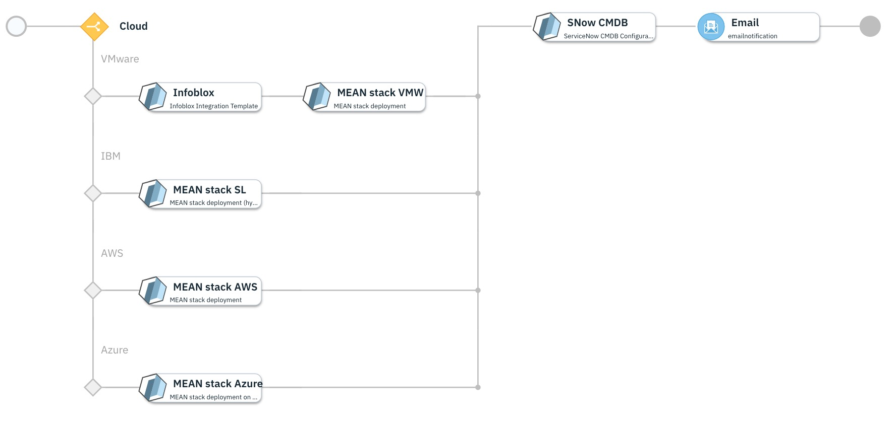
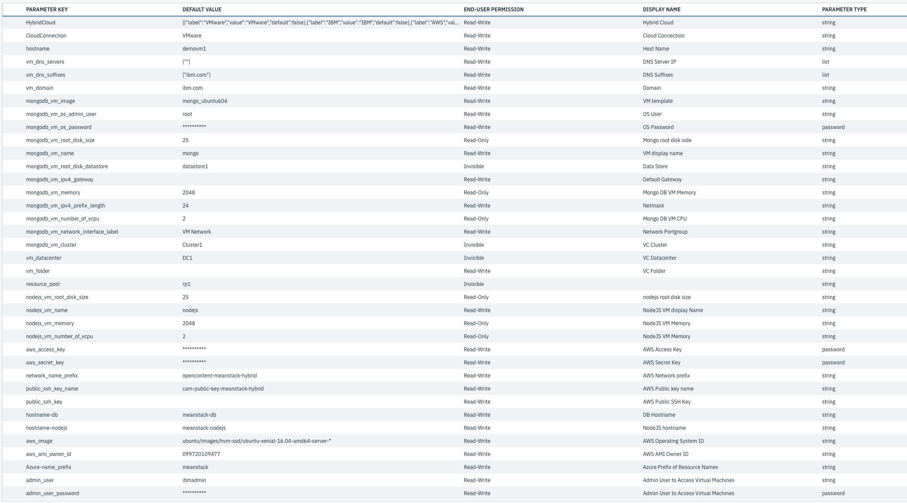

<!---
Copyright IBM Corp. 2018, 2018
This code is released under the Apache 2.0 License.
--->

# Multi Cloud - MEAN Stack deployment

Deploys a hybrid cloud MEAN stack (Mongo, Express, Angular, Node) on your choice of cloud.
This deployment also deploys a simple sample application to validate the stack is operational.
once everything deployed fine it will update the Service Now CMDB and send the email notification.

This service will install and configure MongoDB, Express, AngularJS and Node.js.

### Supported Clouds:
  - VMWare vSphere
  - IBM Cloud
  - Amazon EC2
  - Microsoft Azure

### Prerequisites:

  - Configure IBM Cloud Automation manager 3.1.0 with a connection to a cloud provider. For configuration steps, refer to Knowledge Center
  - Configure an Email server. For configuration steps.
  - Configure Infoblox server to get free/available IP address
  - Ensure that ServiceNow is up and running.

### Service Input parameters:

