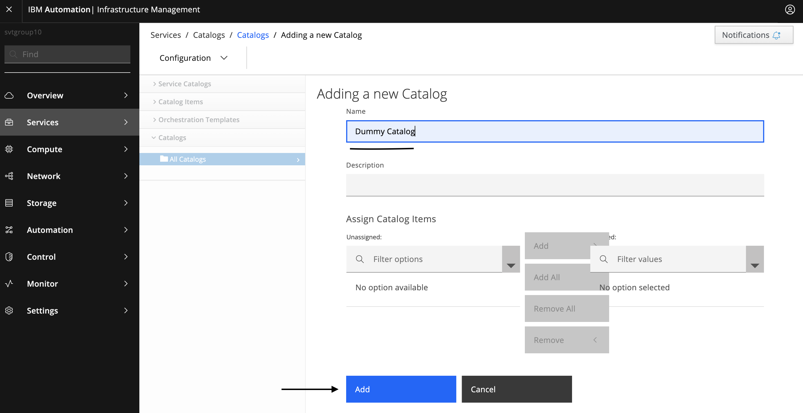
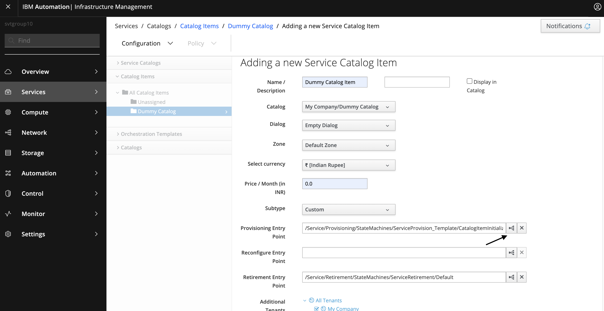

# Infrastructure Management Approval

## Overview


This [Managed services](https://www.ibm.com/support/knowledgecenter/SSFC4F/product_welcome_cloud_pak.html) service is used to get approval from Infrastructure Management before provisioning the resources.

More details on Managed services Service can be found [here](https://www.ibm.com/support/knowledgecenter/SSFC4F/product_welcome_cloud_pak.html).

This service is composed of following terraform template

- [Poll Infrastructure Management for Approval](https://github.com/IBM-CAMHub-Open/starterlibrary/tree/2.5/Other/Approval/InfrastructureManagement) terraform template.

## Deploying the service from Managed services

### Prerequisites

To get approval from Infrastructure Management a `Dummy Service` and a `Dummy Domain` is required to be created.

- Steps to create `Dummy Domain` in Infrastructure Management is are as follows:

**Step 1:** Create a new Automate Domain


**Step 2:** Copy a Automate class `ServiceProvisionRequestApproval` to a new Automate Domain created in the above step


**Step 3:** Add a new instance of Automate class `ServiceProvisionRequestApproval`


- Steps to create `Dummy Service` in Infrastructure Management is are as follows:

**Step 1:** Create a Dialog


**Step 2:** Create a Catalog




**Step 3:** Create a Catalog Item





- Retrieve Catalog Id & Catalog Item Id

**Step 1:** Retrieve IAM Token

Run the following command to get the IAM Token:

```bash
curl -k --location --request POST 'https://<BASE_URL>/idprovider/v1/auth/identitytoken' \
--header 'Content-Type: application/x-www-form-urlencoded' \
--data-urlencode 'grant_type=password' \
--data-urlencode 'username=<LDAP_USERNAME>' \
--data-urlencode 'password=<LDAP_PASSWORD>' \
--data-urlencode 'scope=openid' --no-progress-meter | jq -r '.access_token'
```

Where:

1. `<BASE_URL>`: Hostname to connect to IBM Common Services, Use `$(kubectl -n ibm-common-services get route cp-console --template '{{.spec.host}}')` command to get the hostname.
2. `<LDAP_USERNAME>`: LDAP Username to connect to Infrastructure Management.
3. `<LDAP_PASSWORD>`: LDAP Password to connect to Infrastructure Management.

**Note:** Perform this step If you want to use `Bearer Token` based authentication method to connect to Infrastructure Management to retrieve Catalog Id & Catalog Item Id.

**Step 2:** Retrieve Catalog Id & Catalog Item Id

If you are using `Bearer Token` based authentication method to connect to Infrastructure Management then use below command to retrieve Catalog Id & Catalog Item Id.

```bash
curl -k --location --request GET 'https://<Infrastructure Management Host>/api/service_catalogs?expand=resources' \
--header 'Authorization: Bearer <IAM_Token>'
```

Where:

1. `<IAM_Token>`: IAM Token retrieved in the above step.

If you are using `Basic Authentication` method to connect to Infrastructure Management then use below command to retrieve Catalog Id & Catalog Item Id.

```bash
curl --location --request GET 'https://<Infrastructure Management Host>/api/service_catalogs?expand=resources' \
--header 'Authorization: Basic <Authentication details such as username and password to connect to Infrastructure Management>'
```

**Note:** Basic Authentication using `Username` and `Password` is no longer supported, so it is recommended to use `Bearer Token` based authentication method to connect to Infrastructure Management.

Sample Response:

```text
{
  "name": "service_catalogs",
  "count": 1,
  "subcount": 1,
  "pages": 1,
  "resources": [
    {
      "href": "https://<Infrastructure Management Host>/api/service_catalogs/1000000000005",
      "id": "1000000000005",
      "name": "Dummy Catalog",
      "description": null,
      "tenant_id": "1000000000001",
      "service_templates": {
        "count": 1,
        "pages": 1,
        "resources": [
          {
            "href": "https://<Infrastructure Management Host>/api/service_catalogs/1000000000005/service_templates/1000000000011"
          }
        ],
        "actions": [
          {
            "name": "edit",
            "method": "post",
            "href": "https://<Infrastructure Management Host>/api/service_catalogs/1000000000005/service_templates"
          },
          {
            "name": "delete",
            "method": "post",
            "href": "https://<Infrastructure Management Host>/api/service_catalogs/1000000000005/service_templates"
          },
          {
            "name": "order",
            "method": "post",
            "href": "https://<Infrastructure Management Host>/api/service_catalogs/1000000000005/service_templates"
          },
          {
            "name": "refresh_dialog_fields",
            "method": "post",
            "href": "https://<Infrastructure Management Host>/api/service_catalogs/1000000000005/service_templates"
          },
          {
            "name": "assign",
            "method": "post",
            "href": "https://<Infrastructure Management Host>/api/service_catalogs/1000000000005/service_templates"
          },
          {
            "name": "unassign",
            "method": "post",
            "href": "https://<Infrastructure Management Host>/api/service_catalogs/1000000000005/service_templates"
          }
        ],
        "links": {
          "self": "https://<Infrastructure Management Host>/api/service_catalogs?expand=resources&offset=0",
          "first": "https://<Infrastructure Management Host>/api/service_catalogs?expand=resources&offset=0",
          "last": "https://<Infrastructure Management Host>/api/service_catalogs?expand=resources&offset=0"
        }
      },
      "actions": [
        {
          "name": "edit",
          "method": "post",
          "href": "https://<Infrastructure Management Host>/api/service_catalogs/1000000000005"
        },
        {
          "name": "edit",
          "method": "patch",
          "href": "https://<Infrastructure Management Host>/api/service_catalogs/1000000000005"
        },
        {
          "name": "edit",
          "method": "put",
          "href": "https://<Infrastructure Management Host>/api/service_catalogs/1000000000005"
        },
        {
          "name": "delete",
          "method": "post",
          "href": "https://<Infrastructure Management Host>/api/service_catalogs/1000000000005"
        },
        {
          "name": "delete",
          "method": "delete",
          "href": "https://<Infrastructure Management Host>/api/service_catalogs/1000000000005"
        }
      ]
    }
  ],
  "actions": [
    {
      "name": "query",
      "method": "post",
      "href": "https://<Infrastructure Management Host>/api/service_catalogs"
    },
    {
      "name": "create",
      "method": "post",
      "href": "https://<Infrastructure Management Host>/api/service_catalogs"
    },
    {
      "name": "add",
      "method": "post",
      "href": "https://<Infrastructure Management Host>/api/service_catalogs"
    },
    {
      "name": "edit",
      "method": "post",
      "href": "https://<Infrastructure Management Host>/api/service_catalogs"
    },
    {
      "name": "delete",
      "method": "post",
      "href": "https://<Infrastructure Management Host>/api/service_catalogs"
    }
  ],
  "links": {
    "self": "https://<Infrastructure Management Host>/api/service_catalogs?expand=resources&offset=0",
    "first": "https://<Infrastructure Management Host>/api/service_catalogs?expand=resources&offset=0",
    "last": "https://<Infrastructure Management Host>/api/service_catalogs?expand=resources&offset=0"
  }
}
```

From the above response `Catalog Id` is `1000000000005` and `Catalog Item Id` is `1000000000011`

- Go to `Managed services`
- Navigate to `Manage` -> `Shared parameters` -> `Create data type` -> Enter Name as `Infrastructure Management Authentication Details`, Data type as `im_auth` and Description as `Authentication details such as Username, Password or Bearer token to connect to Infrastructure Management` -> `Create` -> `Add Attributes`. Fill the following attributes:

| Parameter name                  | End-user permission   | Parameter type             | Display name   | Required    |
| :---                            | :---                  | :---                       | :---           | :---        |
| username                        | Read & Write          |string                    | Username       | false       |
| password                        | Read & Write          |password                    | Password       | false       |
| token                           | Read & Write          |password                    | Bearer token   | false       |

- Navigate to `Manage` -> `Shared parameters` -> In `Search data types`, Enter "Infrastructure Management Authentication Details" -> Verify Data type is present
- Go to `Create data object` -> Select data type "im_auth" -> Enter Data Object Name for e.g. "im_auth". Fill the following parameters.

| Parameter name                  | Type            | Parameter description                                  |
| :---                            | :---            | :---                                                   |
| Username                        | string        | Username to connect to  Infrastructure Management      |
| Password                        | password        | Password to connect to  Infrastructure Management      |
| Token                           | password        | Bearer token to connect to  Infrastructure Management  |

**Note:** It is not mandatory to provide values of all three. It depends on type of authentication method you want to use. If you want to use `Basic Authentication` then provide values of both `Username` and `Password` and If you want to use `Bearer Token` based authentication method then provide value of `Token`. Basic Authentication using `Username` and `Password` is no longer supported, so it is recommended to use `Bearer Token` based authentication method to connect to Infrastructure Management.

- Navigate to `Library` -> `Services` ->  `Approval` -> `Infrastructure Management Approval` -> Navigate to `2.0.0.0` version -> Edit -> Composition -> Click on `Resthook` -> Go to `Create` section -> Select `Auth type` -> Enter either Username and Password or Bearer Token to connect to Infrastructure Management depending on the Auth Type.

To deploy this service from Managed services navigate to `Library` -> `Services` ->  `Approval` -> `Infrastructure Management Approval`. Fill the following input parameters and deploy the service.

Note: The parameters indicated as _(hidden)_ have default values.  If you need to change them, make a copy of this service configuration and create a new service in Managed services with the new configuration.

| Parameter name                  | Type            | Parameter description      | Allowed values |
| :---                            | :---            | :---                       | :---           |
| Admin Email                    | string          | Email where approval status to be send                                            | |
| Infrastructure Management Authentication Details                          | Shared Parameter          | Shared Parameter to connect to Infrastructure Management                 | im_auth|
| CURL Option                     | string          | Options for curl command used to retrieve status from Infrastructure Management e.g. `--insecure`                | |
| Wait Time              | string          | Wait time in seconds i.e. time after which poll should again happen to retrieve the approval status. e.g. `5`
| URL                    | string          | Infrastructure Management URL to submit approval request. e.g. `https://<Infrastructure Management Host>/api/service_catalogs/<Catalog Id>/service_templates`                                            | |
| Payload                    | string          | Payload to submit approval request. e.g. `{"action":"order","resource":{"href":"https://<Infrastructure Management Host>/api/service_catalogs/<Catalog_Id>/service_templates/<Catalog Item Id>"}}`                                             | |

Service offers one standard plan. The standard plan offers quick deployment through a few pre-configured parameters, Hence you only need to provide values of remaining parameters.

### License and Maintainer

Copyright IBM Corp. 2022

Service Version - 2.0.0.0
