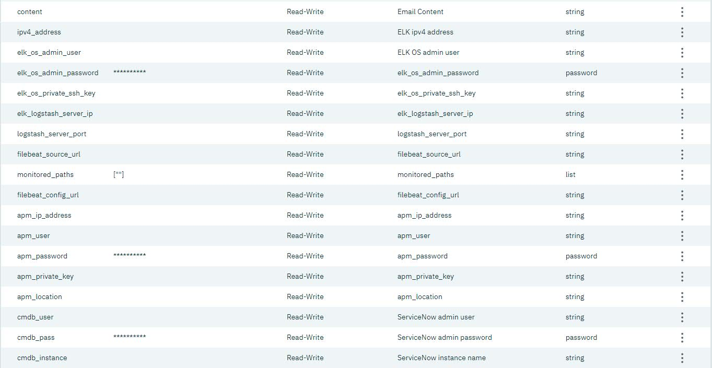

<!---
Copyright IBM Corp. 2018, 2018
This code is released under the Apache 2.0 License.
--->

# Integrate ServiceNow with Cloud Automation Manager using Service Composer

The concepts of Integration templates and Helm charts are introduced in IBM Cloud Automation Manager 2.1.0.2. You can use them in the Service Composer to create services that provide end-to-end utilities.

This sample demonstrates how to build a service that deploys WebSphere Application Server with asset entries that are done on ServiceNow. It also includes APM and ELK configuration. The ELK monitors the logs at run time and APM monitors the performance and availability of your applications to ensure efficient use of resources.

### Prerequisites

    - Configure IBM Cloud Automation manager 3.1.0 with a connection to a cloud provider. For configuration steps, refer to Knowledge Center
    - Configure Chef server and content runtime. For configuration steps.
    - Configure an Email server. For configuration steps.
    - Configure repositories with ELK and APM agent.
    - Ensure that ServiceNow is up and running.

 ### ICP and CAM Versions
| ICP Version | CAM Version|
|------|:-------------:|
| 3.1.0| 3.1.0|

### Service Input Parameters

