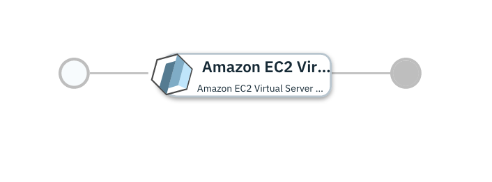

# Single Virtual Machine on AWS

## Overview

This [IBM Cloud Automation Manager](https://www.ibm.com/support/knowledgecenter/en/SS2L37/product_welcome_cloud_automation_manager.html) service configuration uses the [AWS provider](https://www.terraform.io/docs/providers/aws/index.html) to provision a Virtual Machine on AWS.

More details on IBM Cloud Automation Manager Service can be found [here](https://www.ibm.com/support/knowledgecenter/en/SS2L37_4.2.0.0/cam_managing_services.html).

This service is composed of following terraform template

- [Amazon EC2 Virtual Server with SSH key](https://github.com/IBM-CAMHub-Open/starterlibrary/tree/2.4/AWS/terraform/singlefile/hcl) terraform template.

## Deploying the service from IBM Cloud Automation Manager

To deploy this service from IBM Cloud Automation Manager navigate to Library > Services > Virtual Machine > Virtual Machine on AWS. Fill the following input parameters and deploy the service.

Note: The parameters indicated as _(hidden)_ have default values.  If you need to change them, make a copy of this service configuration and create a new service in IBM Cloud Automation Manager with the new configuration. 

| Parameter name                  | Type            | Parameter description      | Allowed values |
| :---                            | :---            | :---                       | :---           |
| Connection                      | connection      | AWS Connection             | |
| region                          | string          | AWS Region                 | |
| vpc_name_tag                    | string          | Name of the Virtual Private Cloud (VPC) this resource is going to be deployed into                                            | |
| subnet_name                     | string          | Subnet Name                | |
| public_ssh_key_name             | string          | Name of the public SSH key used to connect to the virtual guest                                                                | |
| public_ssh_key                  | string          | Public SSH key used to connect to the virtual guest                                                                            | |
| aws_image                       | string          | Operating system image id / template that should be used when creating the virtual image                                   | |
| aws_image_size                  | string          | AWS Image Instance Size    | |
| aws_ami_owner_id                | string          | AWS AMI Owner ID           | |

Service offers one standard plan. The standard plan offers quick deployment through a few pre-configured parameters, Hence you only need to provide values of remaining parameters.

### License and Maintainer

Copyright IBM Corp. 2020

Service Version - 1.0.0.0 
 