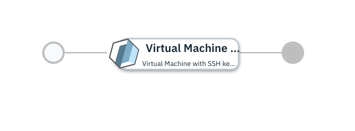

# Single Virtual Machine on Microsoft Azure

## Overview

This [IBM Cloud Pak for Multicloud Management](https://www.ibm.com/support/knowledgecenter/SSFC4F/product_welcome_cloud_pak.html) service configuration uses the [Microsoft Azure provider](https://www.terraform.io/docs/providers/azure/index.html) to provision a Virtual Machine on Microsoft Azure.

This service is composed of following terraform template

- [Virtual Machine with SSH key on Microsoft Azure](https://github.com/IBM-CAMHub-Open/starterlibrary/tree/2.5/Azure/terraform/hcl/singlevirtualmachine) terraform template.

You can first test deploy the service and once satisfied, you can publish the service to the service library and then deploy the production ready service from the service library. 
By default this service is in global namespace. So before you publish you need to duplicate this service (see IBM Cloud Pak for Multicloud Management documentation on how to duplicate a service) in the user assigned namespace and then publish it to service library.

* [Test Deploy the Service](#test-deploy-the-service)
* [Deploying the service from Service Library](#deploying-the-service-from-service-library)

## Test Deploy the Service

To deploy this service from IBM Cloud Automation Manager navigate to Automate Infrastructure > Manage Services > Virtual Machine >  Virtual Machine on Microsoft Azure. Fill the following input parameters and deploy the service.

| Parameter name                  | Type            | Parameter description                    | Allowed values |
| :---                            | :---            | :---                                     | :---           |
| Connection                      | connection      | Microsoft Azure Connection               | |
| azure_region                    | string          | Azure region to deploy infrastructure resources                                                                                      | |
| name_prefix                     | string          | Prefix of names for Azure resources                                                                                      | |
| admin_user                      | string          | Name of an administrative user to be created in virtual machine in this deployment                                                             | |
| admin_user_password             | password        | Password of the newly created administrative usert                                                                                          | |
| user_public_key                 | string          | Public SSH key used to connect to the virtual machine                                                                                        | |

## Deploying the service from Service Library

To deploy this service from Service Library navigate to Automate Infrastructure > Service Library, select the published service and fill the following input parameters and install the service.

| Parameter name                  | Type            | Parameter description                    | Allowed values |
| :---                            | :---            | :---                                     | :---           |
| Connection                      | connection      | Microsoft Azure Connection               | |
| azure_region                    | string          | Azure region to deploy infrastructure resources                                                                                      | |
| name_prefix                     | string          | Prefix of names for Azure resources                                                                                      | |
| admin_user                      | string          | Name of an administrative user to be created in virtual machine in this deployment                                                             | |
| admin_user_password             | password        | Password of the newly created administrative usert                                                                                          | |
| user_public_key                 | string          | Public SSH key used to connect to the virtual machine                                                                                        | |

### License and Maintainer

Copyright IBM Corp. 2020

Service Version - 1.0.0.0 
 