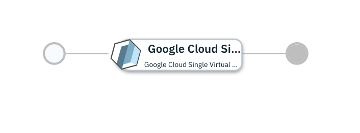

# Single Virtual Machine on GCP

## Overview

This [IBM Cloud Automation Manager](https://www.ibm.com/support/knowledgecenter/en/SS2L37/product_welcome_cloud_automation_manager.html) service configuration uses the [Google Cloud Platform provider](https://www.terraform.io/docs/providers/google/index.html) to provision a Virtual Machine on GCP.

More details on IBM Cloud Automation Manager Service can be found [here](https://www.ibm.com/support/knowledgecenter/en/SS2L37_4.2.0.0/cam_managing_services.html).

This service is composed of following terraform template

- [Google Cloud Single Virtual Machine Example](https://github.com/IBM-CAMHub-Open/starterlibrary/tree/2.4/Google/terraform/hcl/singleVM) terraform template.

## Deploying the service from IBM Cloud Automation Manager

To deploy this service from IBM Cloud Automation Manager navigate to Library > Services > Virtual Machine > Virtual Machine on GCP. Fill the following input parameters and deploy the service.

Note: The parameters indicated as _(hidden)_ have default values.  If you need to change them, make a copy of this service configuration and create a new service in IBM Cloud Automation Manager with the new configuration. 

| Parameter name                  | Type            | Parameter description          | Allowed values |
| :---                            | :---            | :---                           | :---           |
| Connection                      | connection      | GCP Connection                 | |
| unique_resource_name            | string          | A unique name for the resource, required by GCE                                                                                  | |
| gce_ssh_public_key              | string          | Public SSH key to be injected into the authorized_keys of the guest VM                                                      | |
| gce_ssh_user                    | string          | User name to connect to the deployed VMs                                                                                  | |

Service offers two plans standard and advance. The standard plan offers quick deployment through a few pre-configured parameters, Hence you only need to provide values of remaining parameters. The advance plan gives you full control over configuration. In the advance plan, you are required to provide values of all the parameters.

### License and Maintainer

Copyright IBM Corp. 2020

Service Version - 1.0.0.0  
 