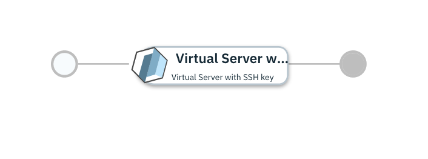

# Single Virtual Machine on IBM Cloud

## Overview

This [IBM Cloud Automation Manager](https://www.ibm.com/support/knowledgecenter/SSFC4F/product_welcome_cloud_pak.html) service configuration uses the [IBM Cloud provider](https://cloud.ibm.com/docs/terraform?topic=terraform-tf-provider) to provision a Virtual Machine on IBM Cloud.

More details on IBM Cloud Automation Manager Service can be found [here](https://www.ibm.com/support/knowledgecenter/SSFC4F/product_welcome_cloud_pak.html).

This service is composed of following terraform template

- [Virtual Server with SSH key](https://github.com/IBM-CAMHub-Open/starterlibrary/tree/2.4/BlueMix/terraform/hcl/scenario1 ) terraform template.

## Deploying the service from IBM Cloud Automation Manager

To deploy this service from IBM Cloud Automation Manager navigate to Library > Services > Virtual Machine > Virtual Machine on IBM Cloud. Fill the following input parameters and deploy the service.

Note: The parameters indicated as _(hidden)_ have default values.  If you need to change them, make a copy of this service configuration and create a new service in IBM Cloud Automation Manager with the new configuration. 

| Parameter name                  | Type            | Parameter description             | Allowed values |
| :---                            | :---            | :---                              | :---           |
| Connection                      | connection      | IBM Cloud Connection              | |
| public_ssh_key                  | string          | Public SSH key used to connect to the virtual guest                                                                                   | |
| hostname                        | string          | Hostname of the virtual instance (small flavor) to be deployed                                                                          | |
| domain                          | string          | Domain of the virtual instance to be deployed                                                                                | |

Service offers one standard plan. The standard plan offers quick deployment through a few pre-configured parameters, Hence you only need to provide values of remaining parameters.

### License and Maintainer

Copyright IBM Corp. 2020

Service Version - 1.0.0.0  
 