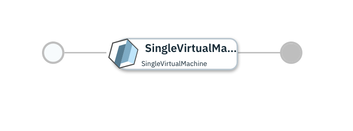

# Single Virtual Machine on VMware

## Overview

This [IBM Cloud Automation Manager](https://www.ibm.com/support/knowledgecenter/en/SS2L37/product_welcome_cloud_automation_manager.html) service configuration uses the [VMware provider](https://www.terraform.io/docs/providers/vsphere/index.html) to provision a Virtual Machine on VMware.

More details on IBM Cloud Automation Manager Service can be found [here](https://www.ibm.com/support/knowledgecenter/en/SS2L37_4.2.0.0/cam_managing_services.html).

This service is composed of following terraform template

- [SingleVirtualMachine](https://github.com/IBM-CAMHub-Open/starterlibrary/tree/2.4/VMware/terraform/hcl/singleVM) terraform template.

## Deploying the service from IBM Cloud Automation Manager

### Prerequisites
- Navigate to Manage -> Shared Parameters -> In Search Data Type, Enter "vSphere Managed Inventory Definition" -> Verify Data Type is present
- Go to Create Data Object -> Select Data Type "vsphere_managed_inventory_definition" -> Enter Data Object Name for e.g. "vsphere_config". Fill the following paramaters.

| Parameter name                  | Type            | Parameter description      | Allowed values |
| :---                            | :---            | :---                       | :---           |
| datacenter                      | string      | The name of a datacenter in which to create the virtual machine and other assets.                                                | |
| resource_pool                   | string          | Name of the default resource pool for the cluster. Must be specified as 'cluster_name/resource_pool'                       | |
| vm_folder                       | string          | vSphere folder name to create the virtual vachine.                                                                         | |
| vm_image_template               | string          | Virtual machine image template name. If it is in a folder then include folder name as follows 'folder_name/image_template_name'                                                             | |
| vm_domain_name                  | string          | Virtual machine domain name.                                                                            | |
| vm_os_user                      | string          | The user name to connect to the virtual machine                                                                          | |
| vm_os_private_ssh_key           | string          | The user private key to connect to the virtual machine.                                                                         | |
| vm_os_public_ssh_key            | string          | Virtual Machine Template User Public Key to be added to the VM                                                                  | |
| vm_os_password                  | string          | The user password to connect to the virtual machine.                                                                         | |
| datastore                       | string          | Virtual machine datastore nam                                                                              | |
| network                         | string          | vSphere Network name.                                                                            | |
| adapter_type                    | string          | Network adapter type for vNIC Configuration                                                                    | |
| dns_servers                     | list          | A list of DNS servers to add on the virtual machine.                                                                         | |
| dns_suffixes                    | list          | A list of DNS search domains to add to the DNS configuration on the virtual machine.                                            | |
| vm_ipv4_gateway                 | string          | IPv4 Gateway Address for network customization on the virtual machine.                                                          | |
| vm_ipv4_netmask                 | string          | Integer value between 1 and 32 for the prefix length (CIDR) to use when statically assigning an IPv4 address                   | |
| vm_clone_timeout                | string          | The timeout, in minutes, to wait for the virtual machine clone to complete.                                                                        | |

To deploy this service from IBM Cloud Automation Manager navigate to Library > Services > Virtual Machine > Virtual Machine on VMware. Fill the following input parameters and deploy the service.

Note: The parameters indicated as _(hidden)_ have default values.  If you need to change them, make a copy of this service configuration and create a new service in IBM Cloud Automation Manager with the new configuration.

| Parameter name             | Type            | Parameter description      | Allowed values |
| :---                       | :---            | :---                       | :---           |
| Connection                 | connection      | VMware Vsphere connection                                                                                    | |
| vm_name                    | string          | Hostname of virtual machine                  | |
| vm_ipv4_address            | string          | IPv4 address for vNIC configuration          | |
| vSphere Managed Inventory Definition                 | sharedparameter      | Data object of type "vsphere_managed_inventory_definition" | |
| VM Memory Allocation (MB)                 | string      |  | |
| VM vCPU Allocation                | string      |  | |
| vm_disk_size                 | string      |  | |

Service offers two plans standard and advance. The standard plan offers quick deployment through a few pre-configured parameters, Hence you only need to provide values of remaining parameters. The advance plan gives you full control over configuration. In the advance plan, you are required to provide values of all the parameters.

### License and Maintainer

Copyright IBM Corp. 2020

Service Version - 1.0.0.0
 